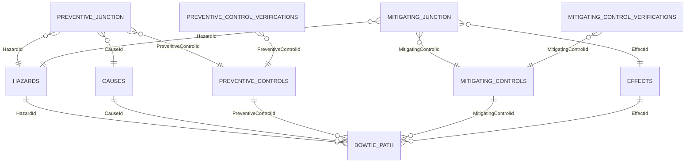

# Data shape for the Safety Bowtie visual

The visual consumes one flat table and displays one hazard at a time. Use a Power BI slicer or page filter on `Hazard ID` or `Hazard Name`. When exactly one hazard remains, the visual renders a single combined bowtie diagram that shows both **Initial controls** and **Additional controls** in the same structure, while keeping them visually distinct. If the `Control Set` field is omitted, the visual falls back to a single bowtie using the available rows.

## Field wells

| Field | Required | Purpose |
|---|---:|---|
| Control Set | no, optional | Canonical values are `Initial` and `Additional`; if omitted, the visual renders one bowtie from the available rows |
| Cause ID / Name | for preventive paths | Stable cause key and display label |
| Cause Tooltip | no | Additional cause information |
| Preventive Control ID / Name | for preventive paths | Stable preventive-control key and display label |
| Preventive Control Tooltip | no | Additional preventive-control information |
| Preventive Control Hierarchy | no | Australian hierarchy-of-controls category |
| Preventive Verification Method | no | One or more verification methods linked to the preventive control |
| Preventive Verification Phase | no | One or more verification phases linked to the preventive control |
| Preventive Before Severity / Probability | no | 882E severity and probability immediately before the preventive control |
| Preventive Before Risk Level | no | Optional derived or imported 882E risk level (`High`, `Serious`, `Medium`, or `Low`); used when the severity/probability pair is unavailable |
| Preventive After Severity / Probability | no | 882E severity and probability immediately after the preventive control |
| Preventive After Risk Level | no | Optional derived or imported 882E risk level; used when the severity/probability pair is unavailable |
| Hazard ID / Name | yes | Hazard key used by slicers and its display label |
| Hazard Tooltip | no | Additional hazard information |
| Mitigating Control ID / Name | for mitigating paths | Stable mitigating-control key and display label |
| Mitigating Control Tooltip | no | Additional mitigating-control information |
| Mitigating Control Hierarchy | no | Australian hierarchy-of-controls category |
| Mitigating Verification Method | no | One or more verification methods linked to the mitigating control |
| Mitigating Verification Phase | no | One or more verification phases linked to the mitigating control |
| Mitigating Before Severity / Probability | no | 882E severity and probability immediately before the mitigating control |
| Mitigating Before Risk Level | no | Optional derived or imported 882E risk level; used when the severity/probability pair is unavailable |
| Mitigating After Severity / Probability | no | 882E severity and probability immediately after the mitigating control |
| Mitigating After Risk Level | no | Optional derived or imported 882E risk level; used when the severity/probability pair is unavailable |
| Effect ID / Name | for mitigating paths | Stable effect key and display label |
| Effect Tooltip | no | Additional effect information |
| Highlight measure | no | Enables cross-highlighting from other visuals |

Names are used as labels and IDs remain the stable keys. A missing name falls back to its ID. Tooltip fields are free text.

## Row shape

Each row may describe a preventive path, a mitigating path, or both:

```text
Cause -> Before risk -> Preventive control -> After risk -> Hazard
Hazard -> Before risk -> Mitigating control -> After risk -> Effect
```

Left-only and right-only rows are supported. Leave all fields for the unused side blank. This avoids creating a Cartesian product between causes and effects.

Repeat IDs to express relationships:

- Many causes to one preventive control: repeat the preventive control ID with different cause IDs.
- Many preventive controls to one hazard: repeat the hazard ID with different preventive control IDs.
- One hazard to many mitigating controls: repeat the hazard ID with different mitigating control IDs.
- One mitigating control to many effects: repeat the mitigating control ID with different effect IDs.

Nodes and links are de-duplicated by Control Set, element kind, and ID. Repeated rows therefore do not create duplicate visual elements.

## Initial and additional controls

When `Control Set` is bound, every selected hazard should have rows for both `Initial` and `Additional`. The visual accepts `Current` or `Existing` as `Initial` aliases and `Proposed`, `Future`, or `Target` as `Additional` aliases for compatibility with legacy models. If `Control Set` is missing, the visual renders a single bowtie from the available rows without requiring both sets.

The diagram keeps the two control sets in one combined layout with distinct colours, labels, and lane offsets so an element may appear in both control sets without a layout collision. Filtering must leave exactly one distinct Hazard ID; otherwise the visual asks the user to select one.

## Risk assessment

Each control has separate before and after Severity and Probability fields. The visual creates a risk node for each pair and assesses it using MIL-STD-882E Table III.

When both control sets exist on the same path, the visual treats the Initial control's after-risk as the intermediate risk. That intermediate risk has two possible outcomes: a dashed bypass directly to the Hazard on the preventive side, or directly to the Effect on the mitigating side; and a solid path through the Additional control to its final risk. The Initial control action and every final-risk link are solid. Only the final risk after the last control is used as the resultant risk in the summary.

Accepted severity values are `I`-`IV`, `1`-`4`, or Catastrophic/Critical/Marginal/Negligible. Accepted probability values are `A`-`F`, or Frequent/Probable/Occasional/Remote/Improbable/Eliminated. Missing or invalid pairs display **Not assessed**.

## Hierarchy of controls

Control hierarchy values are normalized to the Australian six-level hierarchy:

1. Eliminate
2. Substitute
3. Isolate
4. Engineering
5. Administrative
6. PPE

Common word variants are accepted. Unknown non-empty values receive a generic `HC` badge and retain their original text in the tooltip.

## Control verification metadata

Preventive and mitigating controls accept independent verification **method** and **phase** lists. Typical methods include `Review`, `Analysis`, `Demonstration`, `Inspection`, and `Test`; typical phases include `FAT`, `SAT`, and `UAT`.

Values may arrive on repeated linked-table rows or as comma-, semicolon-, or pipe-delimited text. The visual trims, case-insensitively de-duplicates, and stably sorts values for each control. Method and phase are independent lists; the visual does not infer pairings between them.

Every distinct value is shown as its own colour-coded badge on the control, for example `V: Review` and `Phase: FAT`. Badges wrap to additional rows without a fixed limit and the control grows vertically to contain them. Full lists also appear in the control tooltip. Badge colours are stable Power BI theme colours with separate namespaces for methods and phases.

The legend includes interactive **Verification method** and **Verification phase** sections. Selecting a legend value hides or shows controls carrying that value; controls without verification metadata are unaffected.

## Multi-table semantic model

The source model may remain normalized across element dimensions and junction tables. Power BI custom visuals receive one categorical query result, however, so the two junctions must be projected into one sparse visual-facing table. Do not bind two disconnected junction tables directly to the visual: fields from both sides can produce a cause-by-effect Cartesian product before the visual receives the data.

The worked model in [sample-data/semantic-model](../sample-data/semantic-model) uses:

- `hazards`, `causes`, `preventivecontrols`, `mitigatingcontrols`, and `effects` as element dimensions.
- `preventivejunction` at the grain Control Set + Hazard + Cause + Preventive Control.
- `mitigatingjunction` at the grain Control Set + Hazard + Mitigating Control + Effect.
- `preventivecontrolverifications` and `mitigatingcontrolverifications` as control-linked verification bridge tables.
- `bowtiepath` as the appended, sparse presentation table consumed by this visual.



### Build `bowtiepath`

For a step-by-step Power BI Desktop import procedure, see [Import the semantic model](import-semantic-model.md).

1. Load the nine CSV files from [sample-data/semantic-model](../sample-data/semantic-model) as lowercase queries named `hazards`, `causes`, `preventivecontrols`, `mitigatingcontrols`, `effects`, `preventivejunction`, `mitigatingjunction`, `preventivecontrolverifications`, and `mitigatingcontrolverifications`.
2. Create a blank Power Query named `bowtiepath` and paste in [BowtiePath.pq](../sample-data/semantic-model/BowtiePath.pq).
3. The query joins descriptive fields onto each junction independently, adds null columns for the opposite side, and appends the results. This preserves each junction's grain and avoids multiplying preventive rows by mitigating rows.
4. Disable load for the two raw junction queries if they are only staging queries. Keep the five dimensions loaded when they are used by slicers or other report visuals.

Create one-to-many, single-direction relationships from each dimension ID to its matching `bowtiepath` ID. Keep filter direction from dimension to `bowtiepath`; bidirectional relationships are unnecessary and can introduce ambiguous filter paths. The two control dimensions are deliberately role-specific. If controls originate in one source table, create two referenced Power Query dimensions or two role-playing model tables.

Bind all 34 categorical field wells from `bowtiepath`. Use `hazards[HazardName]` or `hazards[HazardId]` in a single-select slicer; its relationship filters `bowtiepath` to the selected hazard. Other dimension slicers can filter the table in the same way.

Risk values belong on the junction assignment, not the control dimension, because the same control may have different assessed risk for different hazards, causes/effects, or Initial/Additional sets. Hierarchy and tooltip attributes normally belong on their element dimensions. Verification metadata is control-level: `BowtiePath.pq` first aggregates each verification bridge to one row per control and only then joins it to the path, preventing verification records from multiplying cause/effect relationship rows.

## Power BI setup

Cross-report filtering is enabled by default in the visual options. Clicking a selectable bowtie element cross-filters the other report visuals, and incoming report highlights dim unrelated bowtie elements. Disable **Cross-report filtering** in the Bowtie options when the visual should remain passive.

For a single-table source:

1. Load [the flat sample CSV](../sample-data/bowtie.csv).
2. Bind each CSV column to its matching field well.
3. Add a slicer using Hazard ID or Hazard Name and enable single selection.
4. Select one hazard. The visual renders a single combined bowtie with Initial and Additional controls distinguished and colour-coded. If `Control Set` is omitted, the visual renders one bowtie from the available rows.

For a normalized semantic model, follow [Multi-table semantic model](#multi-table-semantic-model) and bind the resulting `bowtiepath` fields instead.

The sample includes two hazards, shared controls, every supported relationship cardinality, all six hierarchy categories, optional tooltip blanks, and representative risk levels.
